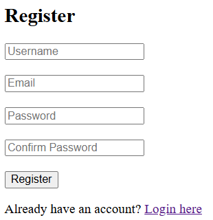

A web-based application designed to help manage tasks and events.

Key Features
- Interactive monthly calendar view using FullCalendar.js
- Add and delete tasks/events 
- Create and account and invite other users to events with optional email invitations via PHPMailer
- View events in both calendar and tabular formats
- User authentication and session management
- Drag-and-drop event rescheduling
- Dialogs for adding and viewing event details
- Backend integration with PHP and MySQL for data storage and retrieval

Login/Register  

Add Event  

Calendar View  

Table View  

